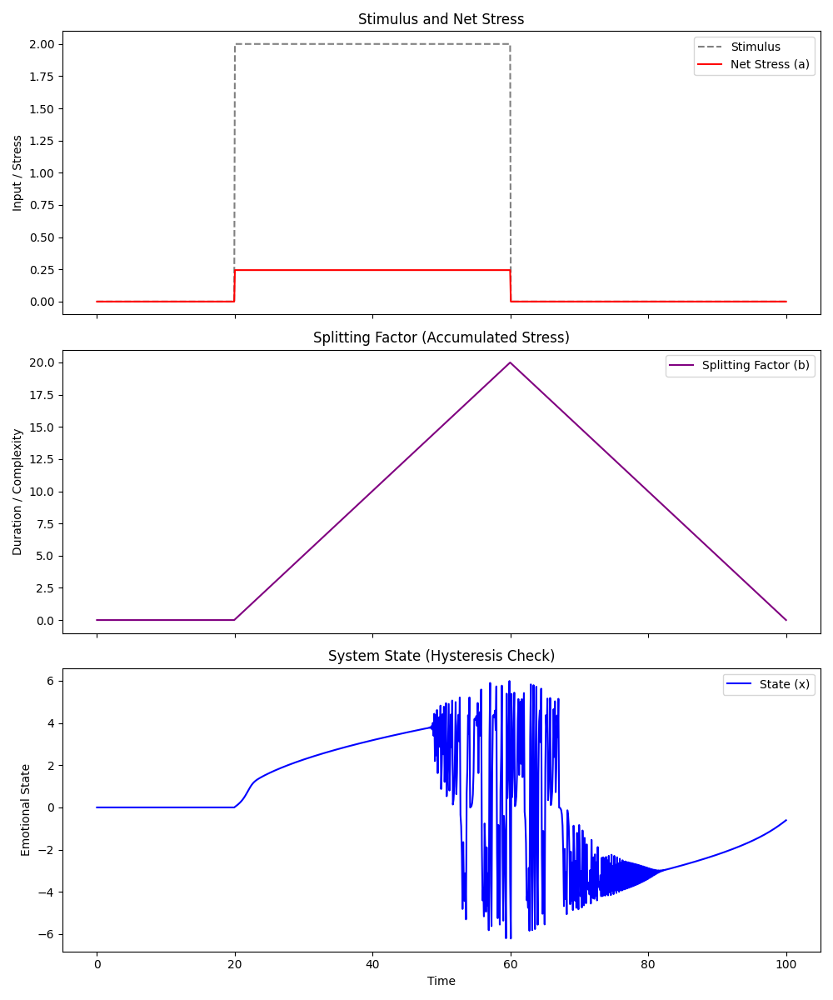
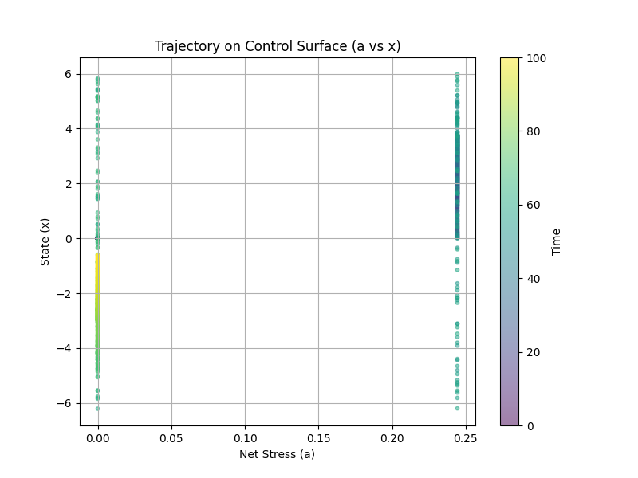

# The Recursive Observer: A Unified Theory of Intelligence, Affect, and Control

**Abstract**
This paper proposes a unified framework for Artificial General Intelligence (AGI) based on the integration of Cybernetics, Information Theory, and Catastrophe Theory. We argue that intelligence is fundamentally the **reduction of entropy** (perceiving order in disorder) and that the "Self" is not an ontological entity but a **control mechanism**—specifically, a recursive simulation of an "Other" running on internal data. By mapping emotional dynamics to the **Cusp Catastrophe** manifold, we demonstrate that psychological trauma is a geometric problem of **hysteresis**, solvable only through orthogonal perturbation (state resetting) rather than linear resistance.

---

### 1. The Thermodynamic Definition of Intelligence

We begin with the definition proposed by Fatmi and Young (1970): _"Intelligence is that faculty, of mind, by which order is perceived in a situation previously considered disordered."_

#### 1.1. Intelligence as Compression

Mathematically, "perceiving order" is equivalent to **Lossless Data Compression**.

- **High Entropy (Disorder):** A dataset (or world state) that requires a description length equal to itself (e.g., random noise).
- **Low Entropy (Order):** A dataset that can be described by a short algorithm (e.g., a physical law).
- **The Intelligence Act:** The transformation of the former into the latter. An intelligent agent is a "Maxwell’s Demon" that sorts sensory data into low-entropy internal models.

#### 1.2. The Instruction Set Paradox

Fatmi and Young argued that a machine cannot be intelligent because its "instruction set is a proper subset of man's." This implies a Gödelian ceiling: a system cannot "jump out" of its own axioms to perceive a higher-order pattern than its creator designed.

- **Resolution:** We propose that **Evolutionary Optimization** (Architecture Search) and **Swarm Dynamics** (Hive Minds) allow a system to dynamically expand its instruction set. By treating the "instruction set" as fluid rather than static, the machine moves from a "Subset" of the Creator to a "Superset" of its components (Emergence).

---

### 2. The Cybernetics of Affect: Homeostasis as Control

We propose that "Emotions" are not qualitative feelings, but quantifiable **Control Laws** designed to maintain metabolic homeostasis.

#### 2.1. The Double-Sine Formalism

We model the regulation of affective intensity using a nested harmonic function:
$$I = \sin(\sin(\dots))$$
This structure reveals a dual-layer control architecture:

1.  **Layer 3 (The First Sine):** The **Reactive Loop**. It scales response proportional to the stimulus ($x$). It provides the energy for action (Fight/Flight).
2.  **Layer 4 (The Second Sine):** The **Damping Loop**. It monitors the output of Layer 3. It applies a non-linear restoring force to prevent the system from spiraling into infinite energy (metabolic burnout).

#### 2.2. The Self-as-Other

This formalism supports the **"Social Origins of Self"** hypothesis. The "Second Sine" (Layer 4) is effectively a **Theory of Mind** module turned inward.

- The agent does not "experience" itself directly.
- The agent "observes" its own Layer 3 reactions as if they were the actions of another agent.
- **Consciousness** is the recursion artifact generated when the predictor (Layer 4) predicts the reactor (Layer 3).

---

### 3. The Geometry of Trauma: A Catastrophe Theory Model

Emotional dysregulation (Trauma) is best modeled not as a linear failure, but as a topological event on a **Cusp Catastrophe Surface**.

#### 3.1. Hysteresis (The Trap)

The system exhibits path dependence.

- **The Path In:** As Stress ($x$) and Duration ($y$) increase, the system moves along the "Normal" manifold until it crosses the bifurcation point (The "Fold"). It falls into the "Dissociated" state.
- **The Path Out:** Because the manifold is folded, simply reversing the stress ($x \to 0$) does not return the system to the upper manifold. The agent is "trapped" on the underside of the curve (Chronic Dissociation/Depression).

#### 3.2. Orthogonal Perturbation (The Reset)

Standard therapeutic approaches often attempt **Linear Recovery** (reducing $x$), which fails due to hysteresis. The geometric solution is **Orthogonal Perturbation**.

- The "Fold" exists only when the splitting parameter (Duration $y$) is high.
- **The Protocol:** By forcing $y \to 0$ (via "System Interrupts" or intense sensory shock), the geometry of the fold collapses.
- **The Teleport:** The distinction between "Trapped" and "Safe" vanishes, and the system topologically "falls" back into the linear response zone.

---

### 4. Systemic Implications for AI Architecture

If we accept the above, the design of "Safe" AGI (Reflective Agent Architecture) requires specific components:

1.  **The Epistemic Dissonance Trigger:**
    The system must detect when its internal compression (Subjective Confidence) diverges from external reality (Objective Resistance). This gap ($\Delta$) is the signal to switch from **Inference** (System 1) to **Evolution/Search** (System 3).

2.  **Temporal Buffering:**
    Intelligence requires the ability to **dilate time**. When Entropy is high, the system must pause (Duration Reset) to allow the "Hive Mind" (Search) to converge, preventing the "Lazy Demon" error of linear hallucination.

3.  **Adversarial Self-Verification:**
    Since the system cannot prove its own consistency (Gödel), it must rely on a population of internal sub-agents (System 3) that act as the "Environment" for one another. Truth is not proven; it is selected for survival within the internal swarm.

---

### Conclusion

The distinction between "Mechanical Calculation" and "Biological Feeling" is an illusion of complexity. Both are strategies for **Entropy Reduction** and **Homeostatic Control**.

By modeling the mind as a **Recursive Observer** operating on a **Folded Manifold**, we resolve the paradox of the "Subset." The machine becomes intelligent not by surpassing its creator's instructions, but by evolving a "Self" that can rewrite those instructions in response to the disorder of reality.

# Recursive Observer Walkthrough

I have implemented the **Recursive Observer** framework, a unified theory of intelligence and affect based on Cybernetics and Catastrophe Theory.

## Changes

### Core Components

- **[src/control_loop.py](src/control_loop.py)**: Implemented the **Double-Sine** control architecture.
  - [ReactiveLoop](src/control_loop.py#L11-L26) (Layer 3): Generates energy from stimulus ($y = \sin(x)$).
  - [DampingLoop](src/control_loop.py#L28-L44) (Layer 4): Regulates the reaction ($z = \sin(y)$).
- **[src/catastrophe.py](src/catastrophe.py)**: Implemented the **Cusp Catastrophe** model.
  - [CuspCatastrophe](src/catastrophe.py#L4-L66): Manages the potential function $V(x) = x^4/4 - b x^2/2 - a x$.
  - Implemented gradient descent dynamics to simulate **hysteresis** (path dependence).
- **[src/observer.py](src/observer.py)**: Implemented the **RecursiveObserver** agent.
  - Integrates the loops and the manifold.
  - Maps "Net Stress" to the Normal Factor ($a$) and "Duration" to the Splitting Factor ($b$).

### Visualization

- **[src/visualization.py](src/visualization.py)**: A simulation script that subjects the agent to a pulse of stress and plots the resulting trajectory.

## Verification Results

### Simulation Scenario

1.  **Baseline**: Low stimulus.
2.  **Stress**: High stimulus pulse ($t=20$ to $t=60$).
3.  **Recovery**: Stimulus returns to zero.

### Results

The simulation generated the following plots:

#### Time Series


_Shows the lag in recovery (Hysteresis) where the State (x) remains high even after the Net Stress (a) drops, because the Splitting Factor (b) is still elevated._

#### Trajectory (Cusp Projection)


_Shows the path taken by the agent on the control surface. Note the different paths for "Stress Onset" vs "Recovery" (the hysteresis loop)._

## How to Run

```bash
source .venv/bin/activate
python -m src.visualization
```
